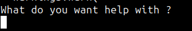
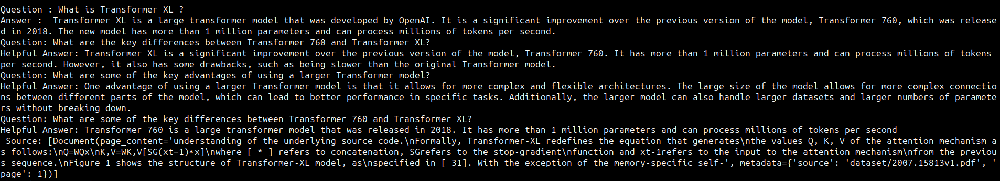

## About

Assessment for Tilda Research to build a Information Retrieval System.

### Before we start

Thanks to Mark to get me this nice short project, had a fun building this. Cannot promise insane accuracy but something that I believe can be worked upon later. !! 

### Tech Used

* FAISS for vector DB
* LangChain for chaining and getting pipeline in place.
* Sentence transformer's all-MiniLM-L6-v2 as embedding extraction model.
* TinyLlama2 1B for LLM (also because I built this whole thing on CPU).

### Getting it up and running

* #### Get the repo locally

* #### Setting up the dependencies
```
pip3 install -r requirements.txt
```

* #### Downloading the dataset and storing it
```
wget https://storage.googleapis.com/tilda-public-dev/data-science/llm_papers.zip 

unzip llm_papers.zip && mv llm_papers dataset
```
(2306.09339v1.pdf this pdf in particular is corrupted)

* #### Converting the pdf files into embeddings and storing to vector DB.
```
python3 vector_ingestion.py
```
This should take some time... :sweat_smile:

* #### Downloading the TinyLLama2 weights
```
wget https://huggingface.co/TheBloke/Tinyllama-2-1b-miniguanaco-GGUF/resolve/main/tinyllama-2-1b-miniguanaco.Q4_K_M.gguf?download=true -O tinyllama-2-1b-miniguanaco.Q4_K_M.gguf
```
* #### Running the demo
```
python3 infer.py
```
It should ask you for your query 



You enter your query and TADA !!




#### Conclusion
This marks my official entry in your first code glance, tried to make it as clean as possible using Black :)

#### Thanks again

